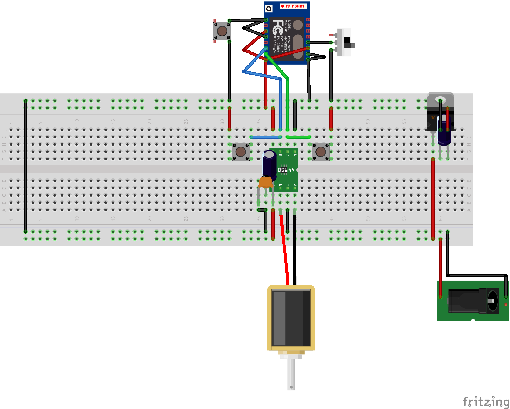

# Google Calendar Irrigation system

**How to use it?** Add a task to your Google Calendar and the irrigation of your garden/lawn will start when the event begins and stop when it ends!

**Why I invented that?** I don't like the interface of cheap irrigation programmers, the irrigation parameters are not flexible enough and it can't be controlled remotely. I wanted a cheap wifi irrigation programmer but I didn't want to build the entire UI for the ESP8266, I preferred to be able to change the irrigation planning from anywhere with simple means. I decided to have the ESP polling one of my Google Calendars, with events to turn on and off the valve at the correct timing.

**How is this made possible?** A ESP8266 connects to your Google Calendar via your home Wifi (using a Google Script) and commands a solenoid valve.

## TOC

  - [Hardware design](#hardware-design)
  - [Software design](#software-design)

## Hardware design

Parts list:

  - 3 x Capacitors (22µF, 0.1µF, 4700µF)
  - 1 x DC motor driver (DRV8872 in this case)
  - 1 x ESP8266 (version ESP07)
  - 1 x 3.3V Voltage regulator (LT1529-3.3 for instance)
  - 1 x 12V 1.5A charger
  - 1 x Female plug (same size as the charger's plug)
  - 1 x Prototyping board
  - 1 x Latching solenoid valve (scavenged from an Orbit 58874N)
  - 3 x Momentary push buttons
  - 1 x Rocker switch
  - 3 x Straight male headers
  - Some wires

## Software design

### Google Script

#### Code
  
You can see the script here: [https://script.google.com/d/...](https://script.google.com/d/1ywsSWqpS012G6y6WJX9rr8T4_rACkuGmcm7dGJIzXeH75jpKXCeG1Bua/edit?usp=sharing)

#### Parameters

  - `_calendarName`: the calendar name that is going to be taken into account
  - `_checkInRate`: the polling rate

### ESP8266 Code

#### Dependencies 

  - [ArduinoJson library](https://github.com/bblanchon/ArduinoJson)
  - [HTTPS Redirect library](https://github.com/electronicsguy/ESP8266/tree/master/HTTPSRedirect)

#### Parameters

Change the constants according to your needs:

  - `DEFAULT_WAKEUP_RATE`: how long should the device be sleeping between each polling. This is the default value which will be overriden at the first call to the Google Script
  - `SSID`: your wifi's SSID
  - `PASSWORD`: your wifi's password
  - `SCRIPT_ID`: your Google Script ID (can be found in the deploy url)
  - `DEBUG`: turn to 1 if you want to see debug information in the console log
  - `CLOSE`: ESP pin number that is connected to the _close_ input of the driver
  - `OPEN`: ESP pin number that is connected to the _open_ input of the driver
